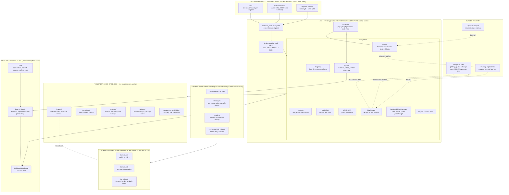

# Cix architecture

A map of the system's components and how they connect — *what exists now*, not a decision record. For why a thing is built the way it is, see [`../adr/`](../adr/); for what has shipped and how it was verified, [`../roadmap/ROADMAP.md`](../roadmap/ROADMAP.md).

**Mermaid rather than a hand-drawn SVG, deliberately** ([cix#582](https://git.home.arpa/itdlabs/cix/issues/582)). The diagram this replaced was laid out by hand, which made it expensive to change, so it was not changed: its own title said *"as of Part 92"* while ROADMAP was past 270, and it was missing most of a month's architecture. A text source diffs, reviews and greps like everything else in this tree, adding a box is adding a line, and `test_docindex` can assert that every component with a daemon source file appears here — a check that is impossible against coordinates and trivial against prose. The ADR corpus made the same argument for itself, and 335 ADRs stayed current while one SVG did not.

## The shape

## Client surfaces

Every capability either surface offers **exists as a REST endpoint first** — the API-First Mandate ([ADR-0005](../adr/0005-api-first-mandate.md)). Neither holds namespace, cgroup, mount, rtnetlink or filesystem logic, and **no other process links `container.h`**.

- **`cixctl`** — one subcommand per endpoint, plus `console`, a real terminal over a hand-rolled WebSocket ([ADR-0043](../adr/0043-container-console-exec-websocket.md)).
- **Web dashboard** — vanilla HTML/CSS/JS, no framework and no bundler, served by cixd. `web/api.js` is generated from `openapi.yaml` by `apigen`.
- **Physical console** — video (`tty0`) and serial (`ttyS0`), a PID 1-spawned `cixctl` ([ADR-0034](../adr/0034-console-login-via-supervised-cixctl.md)).

## cixd

Single-threaded, non-blocking `epoll` reactor ([ADR-0007](../adr/0007-hand-rolled-daemon-no-external-libs.md), [ADR-0009](../adr/0009-cloexec-daemon-fds-before-clone3.md)); hand-rolled HTTP/1.1 and JSON, no external libraries. The reactor must not block — [ADR-0247](../adr/0247-the-reactor-does-not-block-and-that-is-the-defence.md) — so work it cannot afford to wait for is forked ([ADR-0278](../adr/0278-the-reactor-forks-work-it-cannot-afford-to-wait-for.md)).

**Authorisation is one point, not many.** Every operation carries an `x-cix-permission` the contract declares, `authorize_route()` inside `dispatch()` enforces it, and **every read needs a login** ([ADR-0317](../adr/0317-permissions-are-declared-by-the-api-contract.md)). A permission check in a handler is the parallel implementation that ADR forbids. The one trap: anything answered *before* `dispatch()` — the console and build-log WebSocket upgrades — must call `authorize_upgrade_route()` itself.

**The scheduler** runs the platform's own periodic work: `pkg.sync` every 6 hours on a fresh host ([ADR-0316](../adr/0316-a-fresh-host-syncs-recipes-on-a-schedule.md)), hourly `pkg.discover`, and `system.roll` in a nightly 03:00 window that hostbuilds the kernel and cix, assembles, stages and reboots ([ADR-0327](../adr/0327-the-host-follows-its-rolling-packages-in-a-nightly-window.md)).

## Outside the host

- **Recipe sources** — a host takes recipes from any number of them ([ADR-0324](../adr/0324-many-recipe-sources-and-many-package-repositories.md)). Write is a property of the source, not the host; one package belongs to one source; a name offered by two halts until an operator chooses. A source may be signed, and then yields only what its `INDEX` lists. Upstream keys travel in the catalogue ([ADR-0326](../adr/0326-upstream-keys-travel-in-the-signed-catalogue.md)).
- **Package repositories** — many mirrors. Their order is speed, never trust; what is accepted is decided by `artifact_sha256` and the signature.
- **Upstream projects** — where a rolling package's new versions are discovered, authenticated by a signature, a signed checksum list, a signed tag, or declared origin trust ([ADR-0323](../adr/0323-every-package-can-roll-discovery-authentication-and-a-green-build.md)). A source with none of them stays pinned.

**Git is authoritative for recipes, and a change made on a box writes back.** A recipe authored on a host is committed to its source first and only then published.

## Persistent state

Everything cixd owns lives under `BASE_DIR` on the real `cix-containers` partition ([ADR-0018](../adr/0018-containers-partition-for-base-dir-persistence.md)).

An **image** is a set of immutable, content-addressed rootfs trees, one per version, the version being a hash of the installed package set ([ADR-0107](../adr/0107-package-image-versioning.md), [ADR-0108](../adr/0108-image-version-content-hash.md)). **An image's content comes only from its packages** ([ADR-0333](../adr/0333-an-images-content-comes-only-from-packages.md)) — the platform writes nothing into one. A container pins the version current when it was created and keeps running it.

## Container runtime library

`include/container.h`, linked directly into cixd and nothing else.

- **Namespaces and cgroups**, via `clone3` directly — no runc, no libcontainer. User namespaces are the default ([ADR-0179](../adr/0179-user-namespaces-by-default-subordinate-id-allocation.md), [ADR-0207](../adr/0207-btrfs-storage-substrate-userns-by-default.md)), which is why a userns container gets its own rootfs copy or an id-mapped mount rather than an overlay.
- **OverlayFS** for a non-userns container: the image version's rootfs is the shared lower layer, the container owns its upper diff.
- **netplane** talks to the kernel over rtnetlink sockets directly, never shelling out to `ip`/iproute2 — and over `nl80211` for a radio, because a wireless netdev belongs to a wiphy and cannot move alone.
- **`BPF_CGROUP_DEVICE`** is a default-deny allow-list ([ADR-0017](../adr/0017-ebpf-cgroup-device-filter-for-hardware-passthrough.md)): the devices a container declared plus the standard nodes, then a deny epilogue. A container declaring no devices gets no program, and so no restriction.

**What a container is given, and how:** device nodes and the standard `/dev` set are created for it at creation ([ADR-0333](../adr/0333-an-images-content-comes-only-from-packages.md)), `/etc/nsswitch.conf`, the host CA bundle, `/etc/resolv.conf`, `/etc/passwd` and `/etc/os-release` are staged into it, and a real NIC or an entire wiphy can be **moved into its network namespace** — a different mechanism from device passthrough, where exclusivity is automatic because a moved interface stops existing on the host.

## Containers

Each has its own namespaces and cgroup and is driven by cixd, never by a client. `cix-init` is PID 1 inside every one: freestanding, no libc, its own `_start` and syscall trampoline ([ADR-0260](../adr/0260-a-container-declares-services-not-a-command.md)) — a container declares *services*, not a command. A container stops by a message over the control socket cixd already holds, because a signal sent to a namespace's PID 1 before it installs a handler is discarded.

**Container self-view** ([ADR-0262](../adr/0262-a-container-sees-its-own-limits.md), [ADR-0286](../adr/0286-a-container-sees-its-own-disk.md)): `cix-procfuse` bind-mounts per-cgroup `/proc/meminfo`, `cpuinfo`, `stat`, `uptime`, `loadavg` and `swaps` over the container's own `/proc`, so a process inside reads its own limits rather than the host's.

## Host OS

**cixd runs as PID 1 directly** — no initramfs, no systemd ([ADR-0247](../adr/0247-the-reactor-does-not-block-and-that-is-the-defence.md)). Mainline Linux, EFI stub boot.

**A/B root slots**: one boots, the other is the write target for the next update and is never touched live. The control-plane root is a self-built squashfs. The ESP holds the boot entries and an assessment tries-left counter; `confirm_boot()` renames the healthy slot's entry once it is serving, which is the rollback ([ADR-0031](../adr/0031-host-and-package-update-mechanism.md), [ADR-0202](../adr/0202-the-esp-is-reachable-over-rest.md), [ADR-0215](../adr/0215-our-own-efi-boot-manager.md)).

## Keeping this current

`test_docindex` asserts that every component with a daemon source file is named in this document — a string check, which is the whole reason this is text. If you add a subsystem and the gate fails, add it to the diagram above; if you remove one, remove it from both. The gate is what the hand-drawn SVG made impossible, and its absence is why that diagram fell 34 ADRs behind.
